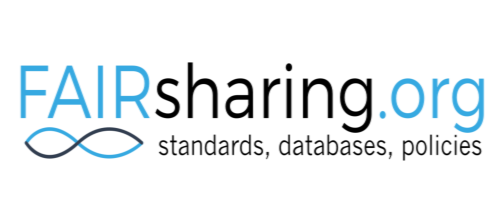
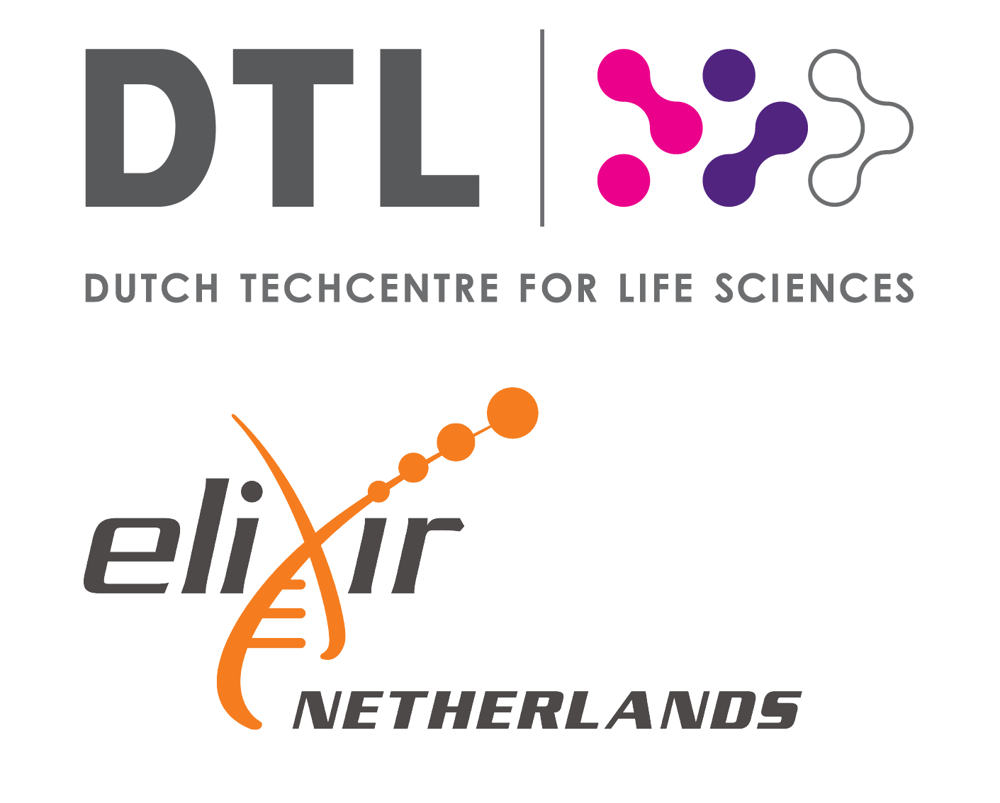
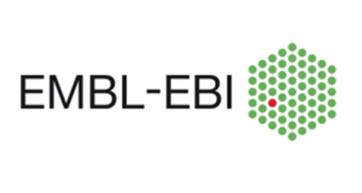
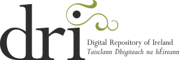
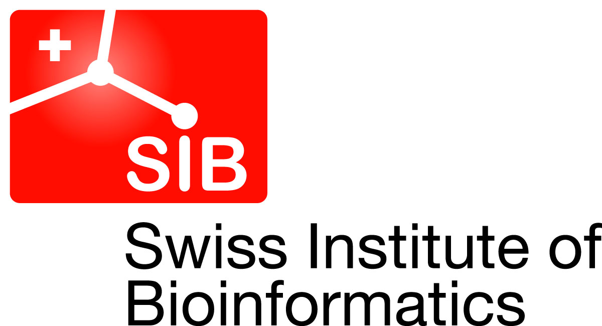
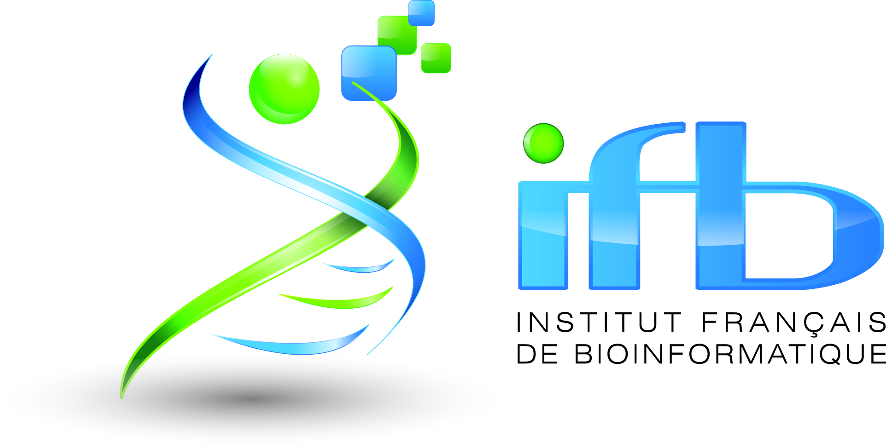

[A terminology for FAIR Stewardship Skills Workshop]{.c2}

[CODATA, Paris, 20-21 May 2019]{.c2}

[]{.c2}

[What did we do?]{.c14}

On 20-21 May 2019, representatives of the research data community met at the [[CODATA](https://www.google.com/url?q=http://www.codata.org/&sa=D&ust=1558716100680000){.c6}]{.c11} headquarters in Paris to take the first steps in building a terminology to describe [[FAIR](https://www.google.com/url?q=https://www.nature.com/articles/sdata201618&sa=D&ust=1558716100680000){.c6}]{.c11} stewardship skills (the skills necessary to make data FAIR and keep them FAIR): the tag [[\#terms4FAIRskills](https://www.google.com/url?q=https://twitter.com/search?q%3D%2523terms4FAIRskills%26src%3Dtyah&sa=D&ust=1558716100681000){.c6}]{.c11}[ was used on Twitter during the event. ]{.c2}

[]{.c2}

[Why is this important?]{.c14}

There have been a number of efforts to develop training materials and to list the competencies required for data stewardship. Building on these previous efforts, the participants of the workshop took the first steps towards creating a formalised terminology describing competencies, skills and knowledge associated with activities involved in making data FAIR. When mature, this will have a variety of use cases, including:

-   [to assist with the creation and assessment of stewardship curricula; ]{.c2}
-   [to help facilitate the annotation, discovery and evaluation of FAIR-enabling materials (e.g for training) and resources; ]{.c2}
-   [to allow the formalisation of job descriptions and CVs with recognised competencies.]{.c2}

[The completed terminology will be of use to trainers who teach FAIR data skills, researchers who want to identify skills gaps in their teams and middle and senior managers who wish to recruit individuals to relevant roles.  ]{.c2}

[]{.c2}

During the workshop we defined [[the](https://www.google.com/url?q=https://drive.google.com/file/d/1mnyIUo1Zx9hUftvkJQnOZlNUnzslezZb/view?usp%3Dsharing&sa=D&ust=1558716100683000){.c6} ]{.c11}[[methodology](https://www.google.com/url?q=https://drive.google.com/file/d/1mnyIUo1Zx9hUftvkJQnOZlNUnzslezZb/view?usp%3Dsharing&sa=D&ust=1558716100683000){.c6}]{.c11} we will use to build this terminology, and reviewed the use cases (how this terminology will be used in practice), which had been  determined via a [[survey](https://www.google.com/url?q=https://github.com/hughshanahan/FAIRTerminologySurveyAnalysis&sa=D&ust=1558716100683000){.c6}]{.c11}. The use cases will ultimately drive the decision on the type of formal representation we will iteratively build (i.e. a controlled vocabulary, a taxonomy, a thesaurus or an ontology). We started the process by reviewing descriptions of FAIR skills provided by [[FAIR4S](https://www.google.com/url?q=https://eoscpilot.eu/content/d75-strategy-sustainable-development-skills-and-capabilities&sa=D&ust=1558716100683000){.c6}]{.c11}[, including their derived 'compound terms' and definitions, as well as the related terms and started the process of building simpler terms (referred to as 'atomic terms') from this.]{.c2}

[]{.c2}

[What next?]{.c14}

[We will work in groups, collaborating online, to continue to add terms, decompose them into atomic terms, refine and provide term definitions. A coordination group will work to clean up and harmonize the list of terms for consistency.  We plan to hold a second workshop in September-November 2019 and - informed by the use cases and competency questions - we will start to identify and build the necessary formal representation. Before that workshop, we intend to release some basic documentation about the work and the draft list of terms and definitions.  ]{.c2}

[]{.c2}

[How to get involved]{.c14}

We welcome additional collaborators in this activity.  If you would like to become involved with this project or would like some clarification, please contact the Organizers at [[terms4FAIRskills\@codata.org](mailto:terms4FAISskills@codata.org){.c6}]{.c11} specifying your name, institutional affiliation and the ways in which you would like to contribute.

[]{.c2}

[Who is involved in \#terms4FAIRskills?]{.c14}

A committee of representatives\* from CODATA, the DCC, DTL/ELIXIR-NL, FAIRsharing and Royal Holloway organised the 1st workshop which brought together a number of experts in FAIR data, data skills training and Knowledge Engineering, from projects and organisations from across Europe[. ]{.c2}

[]{.c2}

[Contributors and Organisers (Organisers = \*)]{.c2}

[]{.c2}

[]{.c2}

[]{#t.79af7eb48097b6f19ed39e8dacb1d891f345b19d}[]{#t.0}

[Name]{.c17}

[Institution]{.c19 .c17}

[Logo]{.c19 .c17}

Allyson Lister

[FAIRsharing and the University of Oxford, Department of Engineering Science, Oxford, UK]{.c1}

[]{style="overflow: hidden; display: inline-block; margin: 0.00px 0.00px; border: 0.00px solid #000000; transform: rotate(0.00rad) translateZ(0px); -webkit-transform: rotate(0.00rad) translateZ(0px); width: 212.00px; height: 75.50px;"}[]{style="overflow: hidden; display: inline-block; margin: 0.00px 0.00px; border: 0.00px solid #000000; transform: rotate(0.00rad) translateZ(0px); -webkit-transform: rotate(0.00rad) translateZ(0px); width: 112.50px; height: 36.20px;"}

[\* Peter McQuilton]{.c17}

[\* Susanna-Assunta Sansone]{.c14}

[Philippe Rocca-Serra]{.c2}

[\* ]{.c17}[Angus Whyte]{.c17}

[]{.c1}

[Digital Curation Centre]{.c1}

[]{.c1}

[]{.c1}

[]{.c1}

[]{style="overflow: hidden; display: inline-block; margin: 0.00px 0.00px; border: 0.00px solid #000000; transform: rotate(0.00rad) translateZ(0px); -webkit-transform: rotate(0.00rad) translateZ(0px); width: 182.00px; height: 58.50px;"}

[]{.c2}

[]{.c2}

[\* Kevin Ashley]{.c14}

[\* Sarah Jones]{.c14}

Catherine Nguyen

[INSERM]{.c1}

[]{.c1}

[]{.c1}

[]{style="overflow: hidden; display: inline-block; margin: 0.00px 0.00px; border: 0.00px solid #000000; transform: rotate(0.00rad) translateZ(0px); -webkit-transform: rotate(0.00rad) translateZ(0px); width: 106.58px; height: 81.50px;"}

Isabelle Perseil

[\* Celia van Gelder]{.c17}

[Dutch Techcentre for LIfe Sciences (DTL), ELIXIR-NL]{.c1}

[]{.c1}

[]{.c1}

[]{.c1}

[]{style="overflow: hidden; display: inline-block; margin: 0.00px 0.00px; border: 0.00px solid #000000; transform: rotate(0.00rad) translateZ(0px); -webkit-transform: rotate(0.00rad) translateZ(0px); width: 153.50px; height: 122.97px;"}

[Mateusz Kuzak]{.c2}

Daniel Bangert

[Goöttingen State and University Library]{.c1}

[]{.c1}

Frans Huigen

[Data Archiving and Networked Services (DANS)]{.c1}

[]{style="overflow: hidden; display: inline-block; margin: 0.00px 0.00px; border: 0.00px solid #000000; transform: rotate(0.00rad) translateZ(0px); -webkit-transform: rotate(0.00rad) translateZ(0px); width: 212.50px; height: 81.66px;"}

[\* ]{.c17}[Hugh Shanahan]{.c17}

[Royal Holloway, University of London]{.c1}

[]{style="overflow: hidden; display: inline-block; margin: 0.00px 0.00px; border: 0.00px solid #000000; transform: rotate(0.00rad) translateZ(0px); -webkit-transform: rotate(0.00rad) translateZ(0px); width: 133.50px; height: 67.86px;"}

Ines Drefs

[GO FAIR International Support and Coordination Office ]{.c1}

[]{.c1}

Kristina Hettne

[Leiden University Libraries]{.c1}

[]{style="overflow: hidden; display: inline-block; margin: 0.00px 0.00px; border: 0.00px solid #000000; transform: rotate(0.00rad) translateZ(0px); -webkit-transform: rotate(0.00rad) translateZ(0px); width: 215.00px; height: 89.33px;"}

[\* ]{.c17}[Laura Molloy]{.c17}

[University of Oxford / CODATA]{.c1}

[]{style="overflow: hidden; display: inline-block; margin: 0.00px 0.00px; border: 0.00px solid #000000; transform: rotate(0.00rad) translateZ(0px); -webkit-transform: rotate(0.00rad) translateZ(0px); width: 215.00px; height: 68.00px;"}

Lennart Stoy

[European University Association]{.c1}

[]{style="overflow: hidden; display: inline-block; margin: 0.00px 0.00px; border: 0.00px solid #000000; transform: rotate(0.00rad) translateZ(0px); -webkit-transform: rotate(0.00rad) translateZ(0px); width: 208.50px; height: 41.70px;"}

Maria Cruz

[VU Amsterdam]{.c1}

[]{style="overflow: hidden; display: inline-block; margin: 0.00px 0.00px; border: 0.00px solid #000000; transform: rotate(0.00rad) translateZ(0px); -webkit-transform: rotate(0.00rad) translateZ(0px); width: 215.00px; height: 86.67px;"}

Melanie Imming

[SURF/Imming Impact]{.c1}

[]{style="overflow: hidden; display: inline-block; margin: 0.00px 0.00px; border: 0.00px solid #000000; transform: rotate(0.00rad) translateZ(0px); -webkit-transform: rotate(0.00rad) translateZ(0px); width: 127.50px; height: 64.05px;"}[]{style="overflow: hidden; display: inline-block; margin: 0.00px 0.00px; border: 0.00px solid #000000; transform: rotate(0.00rad) translateZ(0px); -webkit-transform: rotate(0.00rad) translateZ(0px); width: 135.50px; height: 65.27px;"}

Melissa Burke

[European Bioinformatics Institute]{.c1}

[]{style="overflow: hidden; display: inline-block; margin: 0.00px 0.00px; border: 0.00px solid #000000; transform: rotate(0.00rad) translateZ(0px); -webkit-transform: rotate(0.00rad) translateZ(0px); width: 215.00px; height: 114.67px;"}

Natasha Simons

[Australian Research Data Commons]{.c2} {#h.2cft5ibt6lel .c20}
---------------------------------------

[]{style="overflow: hidden; display: inline-block; margin: 0.00px 0.00px; border: 0.00px solid #000000; transform: rotate(0.00rad) translateZ(0px); -webkit-transform: rotate(0.00rad) translateZ(0px); width: 215.00px; height: 78.67px;"}

Oya Beyan

[Digital Repository of Ireland]{.c1}

[]{style="overflow: hidden; display: inline-block; margin: 0.00px 0.00px; border: 0.00px solid #000000; transform: rotate(0.00rad) translateZ(0px); -webkit-transform: rotate(0.00rad) translateZ(0px); width: 215.00px; height: 73.33px;"}

Patricia Palagi

[SIB Swiss Institute of Bioinformatics, ELIXIR-CH]{.c1}

[]{style="overflow: hidden; display: inline-block; margin: 0.00px 0.00px; border: 0.00px solid #000000; transform: rotate(0.00rad) translateZ(0px); -webkit-transform: rotate(0.00rad) translateZ(0px); width: 173.50px; height: 93.61px;"}

[]{style="overflow: hidden; display: inline-block; margin: 0.00px 0.00px; border: 0.00px solid #000000; transform: rotate(0.00rad) translateZ(0px); -webkit-transform: rotate(0.00rad) translateZ(0px); width: 215.00px; height: 104.00px;"}

[\* ]{.c17}[Simon Hodson]{.c17}

[CODATA, the Committee on Data of the International Science Council]{.c1}

[]{style="overflow: hidden; display: inline-block; margin: 0.00px 0.00px; border: 0.00px solid #000000; transform: rotate(0.00rad) translateZ(0px); -webkit-transform: rotate(0.00rad) translateZ(0px); width: 215.00px; height: 94.67px;"}

[Victoria Dominguez Del Angel]{.c2}

[]{.c2}

[]{.c2}

[]{.c2}

[]{.c2}

[]{.c2}

[Institut Français de Bioinformatique(Elixir-FR)]{.c1}

[]{.c1}

[]{.c1}

[]{.c1}

[]{.c1}

[]{.c1}

[]{style="overflow: hidden; display: inline-block; margin: 0.00px 0.00px; border: 0.00px solid #000000; transform: rotate(0.00rad) translateZ(0px); -webkit-transform: rotate(0.00rad) translateZ(0px); width: 173.08px; height: 87.50px;"}

[]{style="overflow: hidden; display: inline-block; margin: 0.00px 0.00px; border: 0.00px solid #000000; transform: rotate(0.00rad) translateZ(0px); -webkit-transform: rotate(0.00rad) translateZ(0px); width: 111.50px; height: 78.65px;"}

Yan Wang

[Delft University of Technology]{.c1}

[]{.c1}

[]{.c1}

[]{.c1}

[]{style="overflow: hidden; display: inline-block; margin: 0.00px 0.00px; border: 0.00px solid #000000; transform: rotate(0.00rad) translateZ(0px); -webkit-transform: rotate(0.00rad) translateZ(0px); width: 176.50px; height: 108.10px;"}

\* [Paula Martinez Lavanchy]{.c14}

Yann Le Franc

[e-Science Data Factory]{.c1}

[]{style="overflow: hidden; display: inline-block; margin: 0.00px 0.00px; border: 0.00px solid #000000; transform: rotate(0.00rad) translateZ(0px); -webkit-transform: rotate(0.00rad) translateZ(0px); width: 215.00px; height: 64.00px;"}

[]{.c2}
